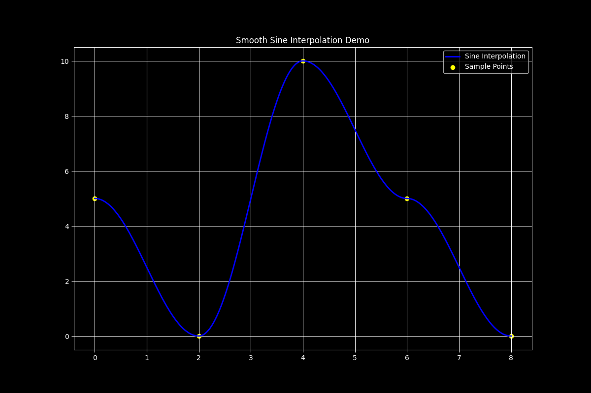

# Sinusoidal Interpolation

> “Look, I’m not saying splines are *bad*.
> I’m just saying I’d rather divide by zero than drag LAPACK into yet another
> side project.”
>
> \- *me, January 11, 2025 at 1:41:17 AM, 10 seconds before making this*

Connecting scattered points smoothly is a common problem that arises in various
applications, such as easing animations, shaping audio envelopes, planning a
robot arm’s trajectory, or simply rendering a visually appealing curve in a
plotting app. The half-period sine wave emerges as a versatile building block
for this task. It never goes outside of the range between two adjacent points,
requires only two numbers per axis to define its position, is computed in
linear time, behaves predictably, is perfectly smooth, and is infinitely
differentiable.

## Why Bother with Half-sine Interpolation?

Half-sine curves are uniquely well-suited for smooth interpolation because they
begin and end with zero slope. This makes it easy to chain them together
without introducing sharp corners or sudden changes in velocity, making them
perfect for modeling natural motion.

Unlike polynomial fits, which can spiral into unpredictable oscillations,
half-sines behave more predictably. Their amplitude is inherently constrained
by the endpoints, which means they don't randomly explode.

They’re also lightweight. While cubic splines require four constraints and a
matrix solve per segment, a half-sine interpolation is a single line of
algebra. It’s efficient and practical, especially since almost every CPU  on
Earth has a hardware `sin` instruction.

Also, tweaking one point only affects the two neighboring segments. That makes
this method especially appealing for real-time applications and interactive
editors where responsiveness matters.

## The Math, Step by Step

1. Given two points $P_1 = (x_1\,y_1)$ and $P_2 = (x_2\,y_2)$ with $x_2 > x_1$,
   we want a function $f(x)$ that  passes through both points and has zero
   slope at each point.

2. A shifted sine can do that:

   $f(x) = A \sin\bigl(\omega(x - \phi)\bigr) + C.$

3. Exactly half a period must fit between the x-coordinates, so

   $\omega = \dfrac{\pi}{x_2 - x_1}.$

6. The derivative $f'(x) = A\omega\cos(\ldots)$ vanishes when the cosine is
   $\pm 1$. That means the sine must start at $-\frac{\pi}{2}$ and end at
   $+\frac{\pi}{2}$. Translating this into a phase offset introduces a single
   unknown $n$.

7. **Solve for amplitude and shift**

   Plugging $x_1$ and $x_2$ into $f$ gives two linear equations:

   $A + C = y_2, \quad -A + C = y_1.$

   Adding and subtracting yields

   $A = \frac{y_2 - y_1}{2}, \qquad C = \frac{y_1 + y_2}{2}.$

8. **Collect the pieces**

   The half-sine segment finally reads

   $f(x) = \frac{y_2 - y_1}{2} \ \sin\ \Bigl(\pi\,\frac{x - x_2 - n} {x_2 -
   x_1}\Bigr) + \frac{y_1 + y_2}{2},$

   with $n$ picked so that

   $f(x_1) = y_1$.

   The closed-form value is

   $-\frac{x_2 - x_1}{2}$

   but in the code you’ll see Newton–Raphson used instead. I predict that
   iterative form is more flexible once you start experimenting with
   non-standard easing profiles or if you need extreme precision.

## Extending the Idea

There’s a lot of flexibility baked into this approach. Instead of forcing the
slope at the endpoints to be zero, you can adjust the phase angle to match any
desired derivative at either end, giving you fine-grained control over velocity
or direction.

Want more control over the curve shape? Replace the default half-period with
any fraction you like. You can still use Newton–Raphson to solve for the
corresponding phase, so the math stays manageable.

If you want to modify this idea for use as a curve fit algorithm instead of an
interpolation algorithm, you can weight the points using a “gravity” approach
to bring them closer together and treat collisions as singular units.
Alternatively, you could define a maximum number of half-sines to generate and
iteratively find the points that minimize the error values.

And you’re not limited to 2D. By feeding each point’s interpolation into
multiple coordinate axes, you can smoothly bend paths through 3D space as well.
